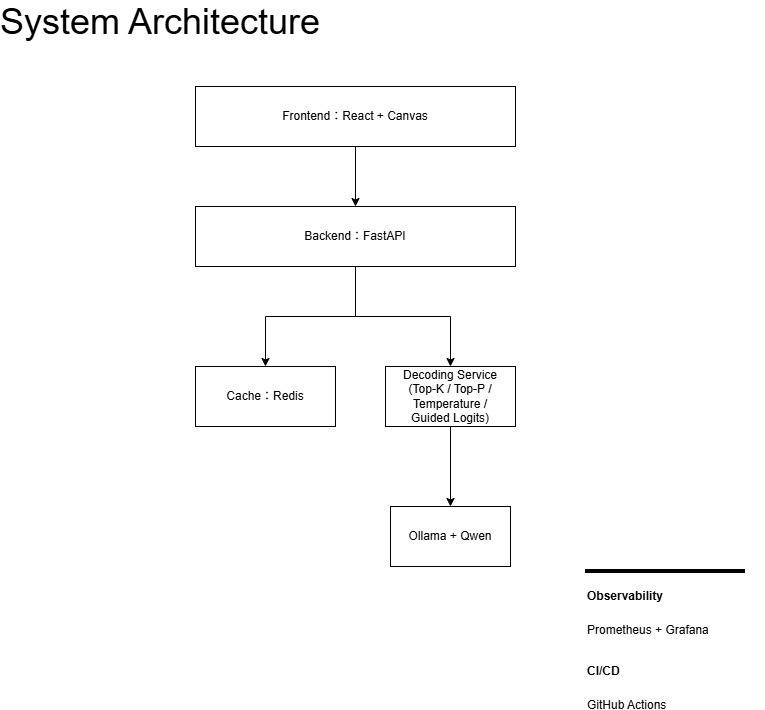

# Token Trail

> Visualizing LLM Decoding Through Interactive Gameplay

透過互動式文字貪食蛇，將大型語言模型（LLM）的自迴歸生成（Auto-regressive Generation）與解碼策略（Decoding Strategy）轉譯為可理解、可探索的遊戲體驗。

Token Trail 不只是展示模型如何生成文字，更著重於幫助使用者理解模型如何做出選擇。

# Demo[待維護]

> 建置中

---
# 專案背景
目前多數使用者透過聊天介面接觸 AI，卻難以理解模型實際運作機制。

Token Trail 希望回答：

- 為什麼模型會選擇某個詞？
- Temperature 如何影響生成結果？
- Context Window 如何改變模型行為？
- 為什麼同一句 Prompt 會產生不同輸出？

# 專案目標
- 建立可視化的 LLM 解碼學習工具
- 驗證遊戲化 AI 教育的可行性
- 展示 FastAPI、Redis 與本地模型整合能力
- 作為資訊轉譯與系統設計的個人作品集

---
# 遊戲玩法
| 模式 | 特色 |
|--------|------|
| 經典模式 | 現代語境語料，建立 LLM 解碼直覺。 |
| 清代模式 | 清代歷史文本語料，結合數位人文與資訊脈絡重建。 |

# 系統特色
## AI 解碼學習體驗
- 解碼流程視覺化
- Context Window 模擬
- Token 機率觀測
- 解碼人格系統
## 系統工程實踐
- Speculative Prefetch 快取機制
- 可觀測性設計
- 非同步 FastAPI 架構
## 跨領域實驗模式
- 清代歷史文本語料模式

# LLM 概念對應表
| LLM 概念                   | 遊戲機制       |
| ------------------------ | ---------- |
| Token Generation         | 食物生成       |
| Next Token Prediction    | 候選食物       |
| Probability Distribution | Token 機率顯示 |
| Context Window           | 蛇身         |
| Sliding Window           | 蛇尾淘汰機制     |
| Decoding Strategy        | 玩家路徑選擇     |
| Temperature              | 遊戲難度調整     |
| EOS Token                | 故事結束       |
| Speculative Execution    | 預載快取       |
| Logits                   | 即時機率面板     |

---
# 核心技術亮點
- 利用 Speculative Prefetch 預先計算候選 Token，降低推論等待時間
- 將 Context Window 視覺化映射為蛇身長度與尾端淘汰機制
- 透過 Guided Sampling 控制候選詞符合遊戲語境
- 使用 Redis 快取降低重複推論成本

# 技術棧
| 層級 | 選擇技術 |
|---------|---------|
| Frontend | React 18 / TypeScript |
| Game Engine | HTML5 Canvas API |
| Backend | FastAPI |
| Cache | Redis |
| AI Runtime | Ollama |
| AI Control | Outlines/ Guided Sampling |
| Observability | Prometheus + Grafana/ Python Structlog |
| DevOps | Docker & Docker Compose |

### 技術選型說明
- React + TypeScript：負責基礎應用狀態、路由管理與觀測面板組件化。
- Canvas：負責 60 FPS 遊戲主循環、蛇身網格物理與碰撞偵測。
- FastAPI：利用 asyncio 實現高效能非同步非阻塞事件處理與背景排程。 
- Redis：儲存 Session 狀態、多路分支預載 Buffer，並以 ZSET 處理 Top-100 排行榜。
- Ollama：本地端執行輕量化 Qwen-2-1.5B，消除雲端 API 的網路延遲不確定性。
- Outlines：利用文法與正規表達式約束（Grammar Constraints），確保候選字詞符合遊戲語意。
- Prometheus + Grafana：監控 API P95 延遲、快取命中率與推論時延，並輸出內含 session_id 的結構化 JSON 日誌。
- Docker Compose： 封裝 FastAPI、Redis 與 Ollama 環境，實現單機一鍵隔離部署。


# 系統架構
詳細架構文件請參閱：docs/architecture/



# 快速開始
## 前置條件
- Docker
- Docker Compose
- Ollama : `ollama pull qwen2:1.5b`

## 環境變數
```markdown
待維護範例：
.env
OLLAMA_HOST=
REDIS_URL=
LOG_LEVEL=
```
## 一鍵啟動
於專案根目錄執行 `docker-compose up --build`，啟動後服務入口:
- Frontend: http://localhost:3000
- API Docs: http://localhost:8000/docs
- Grafana: http://localhost:3001

# 專案目錄結構
```Markdown
token-trail/

├── frontend/
│   ├── src/
│   ├── public/
│   └── tests/
│
├── backend/
│   ├── app/
│   │   ├── api/
│   │   ├── services/
│   │   ├── cache/
│   │   ├── ai/
│   │   └── models/
│   │
│   └── tests/
│
├── infra/
│   ├── docker/
│   ├── prometheus/
│   └── grafana/
│
├── docs/
│   ├── prd/
│   ├── architecture/
│   └── diagrams/
│
├── .github/
│   └── workflows/
│
└── README.md
```
---
# API 文件[待維護]
> 詳細 API 文件請參閱 `/docs/api`

| Method | Endpoint | Description |
|----------|----------|----------|
| POST | /api/v1/game/step | 執行玩家操作 |
| GET | /api/v1/session/{id} | 取得遊戲狀態 |
| POST | /api/v1/leaderboard | 提交排行榜成績 |

# 品質驗證與測試
本專案實施嚴格的 DoD (Definition of Done)，任何代碼合併皆須通過 GitHub Actions 管線：
```
# 1. 執行靜態程式碼檢查 (Linting)
ruff check .

# 2. 執行型別檢查 (Type Check)
mypy .

# 3. 執行單元與整合測試 (使用 Mock 機制隔離 AI 與 Redis)
pytest
```
- AI 推理隔離：透過 pytest-mock 針對 Ollama API 呼叫進行 Mock 隔離，強迫其回傳固定的 Logits 分佈，驗證背景排程與安全降級模組的健壯性。
- Redis 狀態模擬：利用 fakeredis 在記憶體中模擬真實 Redis 的 ZSET 與 String 讀寫，維持 CI 的獨立性與高效速度。

# 開發藍圖
## Phase 1 — Frontend MVP
- 目標：驗證遊戲核心體驗
- 交付內容：
  - Canvas 遊戲引擎
  - 靜態 JSON 模擬資料
  - 故事生成流程
  - 解碼人格系統
## Phase 2 — Backend Integration
- 目標：建立可交付的後端系統
- 交付內容：
  - FastAPI API
  - Redis Session 管理
  - 預載快取機制
  - GitHub Actions CI
## Phase 3 — AI-Native Experience
- 目標：接入實際模型推論
- 交付內容：
  - Ollama Runtime
  - Qwen 模型
  - Guided Sampling
  - Dynamic Token Generation
## Phase 4 — Production Launch
- 目標：完成監控與正式發布
- 交付內容：
  - Prometheus Metrics
  - Grafana Dashboard
  - Leaderboard
  - 社群分享功能

# 核心理念
Token Trail 將大型語言模型的解碼流程轉化為可互動的遊戲體驗，
探索資訊轉譯、系統設計與 AI 教育之間的可能性。
詳細設計理念請參閱： `docs/design-rationale.md`

# 貢獻指南
目前以個人作品集專案為主。
未來若開放社群協作，將補充 Contribution Guide。

# FAQ
### 為什麼使用本地模型？

降低雲端 API 延遲與成本，並避免第三方 API 額度限制。

### 為什麼選擇清代文本？

以作者的歷史研究背景作為起點，探索歷史文本與 AI 教育轉譯結合的可能性。

### 為什麼使用貪食蛇作為遊戲形式？

貪食蛇具備天然的成長、選擇與路徑依賴特性，能夠直觀映射 LLM 的 Token 生成與 Context Window 概念。

### 這個專案適合哪些使用者？

適合對大型語言模型運作原理感興趣的學習者、開發者，以及希望透過互動方式理解 AI 概念的非技術背景使用者。

# License
MIT License
