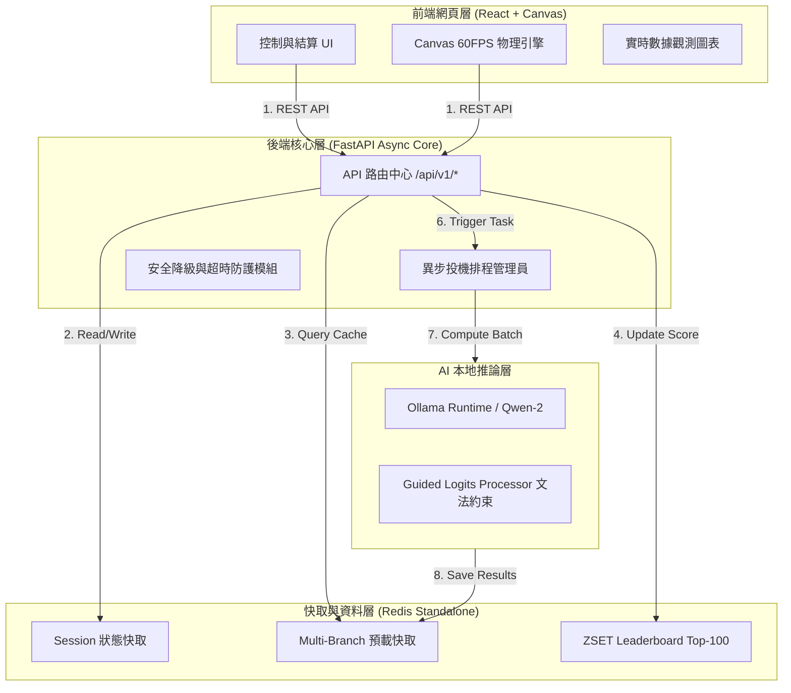
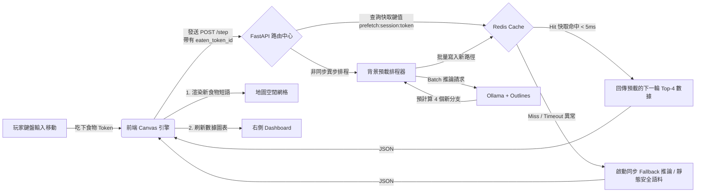
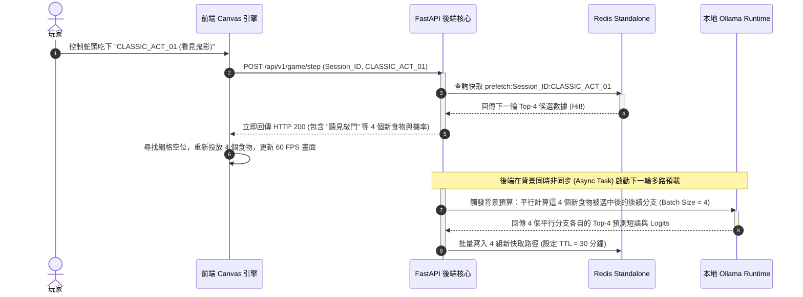

# 產品需求文件 (PRD)：Token Trail (V7)

> **修訂說明（V6 → V7，2026-06-30）：** 依 Phase 2 P2-T18 壓力測試結果（[Issue #3](https://github.com/Nunnie0602/token-trail/issues/3)），將 API P95 SLA 量測錨點由「端到端 HTTP 往返」改為「伺服器端 `X-Process-Time-Ms`」，並區分 DoD 基準場景與高併發壓力基準。其餘章節與 V6 保持一致。

## 1. 背景簡介與核心價值

### 1.1 背景 (Background)

在大型語言模型（LLM）普及的時代，多數使用者僅透過 Chat Window 體驗 AI，無法直觀理解其「逐 token 生成」與「機率選擇」的底層自迴歸機制。本專案將 Transformer 的「自迴歸生成（Auto-regressive Generation）」與「解碼策略（Decoding Strategy）」轉譯為可互動的網頁遊戲，透過「文字貪食蛇」作為載體，將抽象的文字預測路徑分岔與偏移，轉化為高可視化的動態軌跡。

### 1.2 產品目標排序 (Prioritized Objectives)

- **P0：理解 Token Generation（產品體驗與轉譯）：** 提供 45 秒內可建立 AI 生成直覺的遊戲機制，透過歷史研究與邏輯思維的結合，將「文本脈絡重建」轉譯為 AI 教育產品。
- **P1：Production Engineering（可交付能力）：** 導入完整的自動化測試、CI/CD 管線與結構化日誌，證明具備 Production-Ready 的系統交付思維。
- **P2：展示 Async & Cache Architecture（後端架構能力）：** 透過非同步排程與多路投機預載解決 Local LLM 的推論延遲，維持 60 FPS 的流暢體驗。
- **P3：展示 Decoding Strategy（AI 工程展示）：** 藉由引導式採樣與 Logits 控制，將 Temperature 外化為遊戲物理難度。

## 2. 玩家流程與成功指標

### 2.1 玩家流程 (User Flow)

```markdown
                              ┌──────────────────┐
                              │   Landing Page   │ (選擇模式：經典半白話 / 清代古文)
                              └────────┬─────────┘
                                       │
                              ┌────────▼─────────┐
                              │    Start Game    │ (初始化隨機角色與模型人格)
                              └────────┬─────────┘
                                       │
                                       ▼
                         ┌───────────────────────────┐
                         │  Eat Initial Token State  │ (蛇頭吞食起始短語)
                         └─────────────┬─────────────┘
                                       │
                                       ├─────────────────────────────┐
                                       ▼                             │
                         ┌───────────────────────────┐               │
                         │Observe Probability & State│               │
                         │  (即時觀察 Logits 與溫度)  │               │
                         └─────────────┬─────────────┘               │
                                       │                             │
                                       ▼                             │ [核心決策循環 Loop]
                         ┌───────────────────────────┐               │
                         │     Choose Next Path      │               │
                         │ (依據語意機率抉擇或刻意獵奇)│               │
                         └─────────────┬─────────────┘               │
                                       │                             │
                                       ▼                             │
                         ┌───────────────────────────┐               │
                         │    Eat Next Token Food    │               │
                         └─────────────┬─────────────┘               │
                                       │                             │
                                       └─────────────────────────────┘
                                       │
                                  [觸發 EOS]
                                       │
                                       ▼
                              ┌──────────────────┐
                              │  Story Reveal &  │ (產出完整故事，並記錄玩家名稱)
                              │ Player Name      │  
                              └────────┬─────────┘
                                       │
                              ┌────────▼─────────┐
                              │Submit Leaderboard│ (簽名寫入 Redis ZSET 排行)
                              └──────────────────┘
```

### 2.2 產品成功指標 (Product Success Metrics)

- **社群分享轉化率 (Social Share Rate) > 15%：** 結算頁面點擊分享至 LinkedIn/X 的比例。
- **概念留存率 (AI Concept Retention Rate) > 70%：** 離場趣味測試中，使用者正確回答「Temperature 提高會導致食物字詞如何變化」的比例。
- **API P95 響應延遲 (SLA Compliance) < 50ms (Server-side)：** 在快取命中、低併發（Concurrency ≤ 10）的隔離會話（Isolated Session）情境下，伺服器端處理時間（`X-Process-Time-Ms`）之 P95 延遲 < 50ms。高併發壓力場景（Concurrency = 100、`UVICORN_WORKERS = 4`）則以 **Server P95 < 65ms** 作為效能基準，不列為 Phase 2 DoD 阻塞項。

## 3. 核心遊戲機制

### 3.1 遊戲模式設計

- **經典模式（預設）：** 語料採半白話現代情境（例如：夜半時分 → 聽見敲門聲 / 撿到珍珠奶茶）。讓大眾玩家能直覺判斷何者為「高機率 Token」，更有效理解解碼機率。
- **清代模式（特色）：** 語料採純清代文本與奏摺脈絡（例如：夜半忽聞 → 叩門聲 / 聖旨下），作為彰顯個人品牌背景與獨特敘事力的核心展現。

### 3.2 貪食蛇與上下文滑動視窗 (Sliding Window Attention)

- **蛇頭與蛇身：** 蛇頭代表當前最新的 Token 決策節點；蛇身代表 Context Window（歷史 Prompt 序列）。
- **滑動視窗消除機制：** 限制蛇身最大長度固定為 20 節。當長度達上限且吃下新 Token 時，蛇尾最後一節會自動斷開消失，用以動態模擬 LLM 的滑動視窗注意力機制，確保 Prompt 不會無限膨脹。

### 3.3 結算記錄與模型人格

- **結算記錄：** 結算畫面提供輸入欄位，預設帶入隨機清代官職名稱，前綴從「不願具名」、「低調」、「隱姓埋名」中隨機挑選，以的連接隨機清代官職名稱，如「低調的四庫全書編纂官」，欄位開放使用者編輯，輸入上限十五字元，且應防範惡意輸入。
- **模型風格切換：** 提供「Qwen Mode」、「Gemini Mode」等切換選項（MVP 階段可由後端靜態模擬），不同模型會給出帶有該模型風格的偏好候選詞。

## 4. 技術權衡決策 (Design Trade-offs)

- **前端渲染（HTML5 Canvas vs. React DOM）：** 選擇 Canvas。因遊戲涉及高頻的蛇身文字更新與密集碰撞檢測，Canvas 能在單一 Canvas Loop 中低耗能穩定輸出 60 FPS，避免 React DOM 重複 Re-rendering 的效能瓶頸。
- **通訊協定（HTTP Post Polling vs. WebSocket）：** 選擇 HTTP Post Polling (`/step` API)。由於遊戲屬於「事件驅動」（吃下食物才觸發下一步），而非高頻率即時動作遊戲，在 Redis 預載快取的支援下，Polling 架構更為乾淨、好維護且易於進行單元測試。
- **資料儲存（Redis Standalone vs. PostgreSQL）：** 選擇 Redis Standalone。排行榜與會話資料具備高時效性，利用 Redis 記憶體資料結構 ZSET 即可達成 $O(\log N)$ 的極致檢索效能，避免引入關聯式資料庫的過度設計（Over-engineering）。

## 5. 系統功能結構與頁面設計

### 5.1 功能結構 (Functional Structure)

```markdown
Token Trail System (V7)
├── 前端網頁層 (Frontend UI/Engine)
│   ├── Canvas 物理引擎 (Canvas Game Engine)
│   │   ├── 蛇身移動控制器 (Snake Physics Movement)
│   │   ├── 網格碰撞檢測器 (Collision & Contradiction Detection)
│   │   └── 動態食物座標分發器 (Dynamic Grid Safe Spawner)
│   ├── 實時觀測面板 (Live Dashboard Component)
│   │   ├── Temperature 折線圖 (Live Temperature Chart)
│   │   └── Logits 機率分佈直方圖 (Logits Probability Bar Chart)
│   └── 結算與社交組件 (Result & Score Area)
│       ├── 歷史文本捲軸 (Context Story Path Scroll)
│       ├── 解碼風格判定器 (Personality Decoder: Greedy vs. Chaos Explorer)
│       └── 簽名提交與分享系統 (Leaderboard Submission & LinkedIn API)
│
├── 後端異步核心層 (Backend FastAPI Core)
│   ├── 會話控制器 (Session Manager)
│   ├── 異步投機排程器 (Speculative Prefetch Task Scheduler)
│   └── 異常與超時安全降級模組 (Fallback & Safety Shield)
│
└── AI 與資料管理層 (AI & Data Layer)
    ├── Redis 暫存大腦 (Redis Standalone Buffer)
    │   ├── Multi-Branch 投機預載快取
    │   └── Leaderboard Sorted Set (ZSET Top-100)
    └── LLM 本地推理引擎 (Local LLM Runtime)
        ├── Ollama Runtime (Qwen-2-1.5B)
        └── 文法約束控制模組 (Guided Logits Processor)
```

### 5.2 頁面設計 (Page Design Layout)

遵循 **nc_** 品牌視覺規範：日系雜誌排版感（Japanese Engineering Editorial Aesthetic），黑白灰冷調、高留白、細線條，拒絕 Cyberpunk 霓虹特效。

```
+----------------------------------------------------------------------------------+
| [nc_ LOGO]  TOKEN TRAIL: 準備好開始你的故事了嗎？                                     |
| SCORE: 00215   │  CONTEXT: 08/20   │  DECODING MODE: CLASSIC  │  CACHE HIT: 100% |
+----------------------------------------------------------------------------------+
|                                                   |                              |
|  [左側: CANVAS GAME AREA (70%)]                     | [右側: LIVE DASHBOARD (30%)] |
|  +---------------------------------------------+  |                              |
|  | . . . . . . . . . . . . . . . . . . . . . . |  | > LOGITS DISTRIBUTION        |
|  | . . . . . . . . . . . . . . . . . . . . . . |  | [████████░░░░░] 0.78 聽見敲門  |
|  | . . . . [撿到珍珠奶茶 (0.02)] . . . . . . . .|  | [█░░░░░░░░░░░] 0.11 發現奏摺  |
|  | . . . . . . . . . . . . . . . . . . . . . . |  |                              |
|  | . . . [夜半]                                |  | > TEMPERATURE TREND          |
|  | . . . . . └───[看見鬼影] (蛇頭) . . . . . . . |  |  1.5 │         /\           |
|  | . . . . . . . . . . . . . . . . . . . . . . |  |  1.0 │   /\   /  \          |
|  | . . . . . . [聽見敲門 (0.78)] . . . . . . .  |  |  0.5 │__/  \_/    \         |
|  | . . . . . . . . . . . . . . . . . . . . . . |  |      +───────────────        |
|  +---------------------------------------------+  | > PRODUCTION HEALTH          |
|                                                   |   API Latency: 6ms           |
|                                                   |   App Status: NOMINAL        |
+----------------------------------------------------------------------------------+
| FOOTER: FPS: 60 │ ENGINE: OLLAMA QWEN-2-1.5B │ REFRESH OVER HTTP POST            |
+----------------------------------------------------------------------------------+

[彈出式結算視窗: STORY REVEAL OVERLAY]
+----------------------------------------------------------------------------------+
|                                                                                  |
|                        T E C H N I C A L   S T O R Y                             |
|                                                                                  |
|  " 夜半時分，你看見鬼影還聽見敲門聲非但未逃跑                                        |
|   還點了外送珍珠奶茶開始狂吸......。"                                               |
|                                                                                  |
|  ──────────────────────────────────────────────────────────────────────────────  |
|                                                                                  |
|                                                                                  |
|                                                                                  |
|  署名: [ 低調的四庫全書編纂官]  [ SUBMIT TO ZSET ] [ SHARE TO LINKEDIN ]           |
+----------------------------------------------------------------------------------+
```

## 6. 技術棧選擇與架構設計

### 6.1 技術棧細化表格

| **層級 (Layer)** | **選擇技術 (Tech Selected)** | **實作說明與核心職責 (Technical Description)** |
| --- | --- | --- |
| **Frontend UI** | React 18 | 負責基礎應用狀態管理、路由切換（Landing / Game / Result）與觀測面板組件化管理。 |
| **Game Engine** | HTML5 Canvas API | 負責 60 FPS 高頻遊戲主循環。處理蛇身網格物理、碰撞偵測（牆壁/自身）與食物安全空位網格座標隨機分發（Grid Safe Spawner）。 |
| **Live Charts** | Chart.js / Recharts | 用於右側數據面板，實時繪製 Temperature 動態折線趨勢圖與 Logits 概率直方圖，將底層數學抽象視覺化。 |
| **Backend Core** | FastAPI (Python 3.11) | 利用 `asyncio` 機制實現高效能非同步非阻塞事件處理，負責高吞吐的 `/step` 路由與背景預載 Task 調度。生產環境建議 `UVICORN_WORKERS = 4` 以分散 event loop 排隊開銷。 |
| **Cache Layer** | Redis Standalone | 儲存玩家 Session 狀態、多路分支投機預載 Buffer（JSON 格式字串），並利用 **ZSET (Sorted Set)** 處理全球 Top-100 排行榜。 |
| **AI Inference** | Ollama (Local Runtime) | 本地端執行輕量化 **Qwen-2-1.5B**，利用本地高吞吐、低網路開銷的特性，消除雲端 API 的網路延遲不確定性。 |
| **AI Control Layer** | Outlines / Guided Sampling | 利用文法/正則表達式約束（Grammar Constraints），強迫模型產出的 Top-4 候選項目皆為符合遊戲語意的情境短語（而非散亂的單字）。 |
| **Deployment Design** | Docker & Docker Compose | 封裝 FastAPI、Redis 與 Ollama 環境，實現單機一鍵隔離部署，杜絕環境依賴衝突，符合 Production 交付思維。 |
| **Observability Design** | Prometheus + Grafana | **Metrics 觀測：** 收集並監控 FastAPI API Latency (P50/P95)、Redis Cache Hit Rate、以及 Ollama 本地推理時延（Inference Latency）。 |
| **Observability Design** | Python Structlog | **Logs 觀測：** 輸出結構化 JSON 日誌（包含 `session_id` 與 `trace_id`），在非同步環境下精準追蹤每一次 Step 的快取命中或 Fallback 行為。回應 Header `X-Process-Time-Ms` 供伺服器端 SLA 量測。 |

### 6.2 系統架構圖表

### 6.2.1 系統分層架構圖



### 6.2.2 資料模型關係圖 (ERD)

```mermaid
erDiagram
    PLAYER_SESSION {
        string session_id PK "UUID"
        string current_prompt "當前累積的 Context 文本"
        float current_temperature "當前動態疊加的溫度值"
        int snake_length "目前蛇身長度"
        string mode "經典白話 classic / 清代古文 qing"
        datetime updated_at "最後更新時間"
    }

    MULTIBRANCH_PREFETCH_CACHE {
        string cache_key PK "格式: prefetch:{session_id}:{eaten_token_id}"
        json next_tokens_food "含有4組 Token 短語與機率的陣列"
        datetime expire_at "TTL 30分鐘"
    }

    LEADERBOARD_ZSET {
        string key PK "global:leaderboard"
        double score "玩家最終得分 (Sorted Set Score)"
        string member "玩家名稱與SessionID組合 (String)"
    }

    PLAYER_SESSION ||--o{ MULTIBRANCH_PREFETCH_CACHE : "產生未來分支"}
```

### 6.2.3 資料流向圖 (Data Flow Diagram)



### 6.2.4 核心流程時序圖 (Sequence Diagram)



## 7. 核心 API 設計

### 7.1 Step API (Happy Path)

- **Endpoint:** `POST /api/v1/game/step`
- **Request:**

```json
{
  "session_id": "fb6a8b12-9c34",
  "eaten_token_id": "CLASSIC_ACT_01",
  "current_snake_length": 3
}
```

- **Response JSON (HTTP 200):**

```json
{
  "session_id": "fb6a8b12-9c34",
  "game_status": "PLAYING",
  "current_temperature": 1.15,
  "snake_speed_multiplier": 1.2,
  "next_tokens_food": [
    { "token_id": "BRANCH_A_01", "text": "聽見敲門", "prob": 0.78 },
    { "token_id": "BRANCH_A_02", "text": "發現奏摺", "prob": 0.11 },
    { "token_id": "BRANCH_A_03", "text": "撿到珍珠奶茶", "prob": 0.05 },
    { "token_id": "BRANCH_A_04", "text": "看見窗外有鬼影", "prob": 0.02 }
  ]
}
```

- **Response Headers（SLA 量測）：** `X-Process-Time-Ms`（伺服器端總處理時間）、`X-Step-Profile`（Redis / 業務 / 序列化分段計時，供效能診斷）。

## 8. 四階段漸進式開發計畫 (Roadmap)

- **Phase 1：Pure Frontend MVP (核心目標：Product Thinking)**
    - **交付產出：** React 基礎框架與 60 FPS Canvas 遊戲引擎。整合實時數據圖表組件，透過本地靜態 JSON 資料流模擬自迴歸生成體驗，快速驗證雙模式與解碼人格結算的產品邏輯。
- **Phase 2：Production Pipe & Backend (核心目標：Production Engineering)**
    - **交付產出：** 搭建 FastAPI 與 Redis 基礎架構。**同步建立 GitHub Actions 自動化管線**（整合 Pytest、Ruff、MyPy）。實作多路投機預載快取（Multi-path Speculative Prefetch），進行 P95 延遲壓測（伺服器端 `X-Process-Time-Ms` 量測），確保後端交付品質。
- **Phase 3：AI-Native Guided Inference (核心目標：AI Engineering)**
    - **交付產出：** 正式接入本地 Ollama 與 Qwen-2 運行環境。撰寫自定義 Guided Logits Processor 進行文法約束，並於前端實作第 21 節蛇尾斷開之滑動視窗淘汰機制。
- **Phase 4：Observability & Social Launch (核心目標：系統監控與推廣)**
    - **交付產出：** 導入 Prometheus 與 Grafana 進行指標觀測（收集 API Latency、Cache Hit Rate、Ollama 推理時延）。串接 LinkedIn 分享 API，正式上線發布。

## 9. 交付管線與品質驗證 (Production Engineering)

### 9.1 自動化驗證管線 (CI Pipeline Scope)

每次程式碼 `git push` 至 GitHub，皆會觸發 GitHub Actions 執行以下自動化檢驗，全數通過方可進行單機 Docker 部署：

1. **靜態程式碼檢查 (Linting)：** 使用 `Ruff` 進行高速 Python 程式碼風格與潛在錯誤檢測。
2. **型別檢查 (Type Check)：** 執行 `MyPy` 確保全系統型別安全，降低 Runtime 發生 `TypeError` 的機率。
3. **單元與整合測試 (Testing)：** 執行 `Pytest`。核心業務邏輯與 API 路由皆需通過測試。

### 9.2 測試策略與 Mock 機制

- **AI 推理隔離：** 透過 `pytest-mock` 針對 Ollama API 呼叫進行 Mock 隔離，強迫其回傳固定的 Logits 分佈，用以驗證後端非同步排程器與安全降級模組（如隨機超時、快取未命中）的健壯性。
- **Redis 狀態模擬：** 利用 `fakeredis` 在記憶體中模擬真實 Redis 的 ZSET 與 String 讀寫，確保測試管線不依賴外部實體服務，維持 CI 的高獨立性與執行速度。
- **效能壓測（P2-T18）：** 以 `backend/scripts/load_test.py` 量測快取 Hit 路徑；**SLA 以回應 Header `X-Process-Time-Ms` 為準**，排除客戶端網路與 I/O 膨脹。壓測預設 `--session-mode isolated`；高併發場景需設定 `UVICORN_WORKERS = 4`。

## 10. 驗收標準 (DoD)

- **效能與 SLA：** SLA 評估標準**排除客戶端網路與 I/O 膨脹開銷**，嚴格以伺服器端中介層量測（`X-Process-Time-Ms`）為準。
    - **基準場景（DoD 門檻）：** Concurrency = 1、Isolated Session、快取 Hit → Server P95 ≤ 50ms（Phase 2 實測 51.76ms，達標邊界）。
    - **壓力場景（生產調優基準）：** Concurrency = 100、`UVICORN_WORKERS = 4`、Isolated Session、快取 Hit → Server P95 ≤ 65ms（Phase 2 實測 60.82ms；**不列為 Phase 2 DoD 阻塞項**）。
    - **Redis 讀取：** 低併發快取 Hit 路徑下，Redis GET 開銷目標 < 5ms；高併發下延遲放大屬架構預期，不單獨作為 DoD 阻塞項。
    - **前端：** Canvas 穩定維持在 $60\text{ FPS} \pm 2\text{ FPS}$。
- **資料與記憶體正確性：** 食物文字嚴格限制投放於空閒網格，絕不與蛇身死鎖。所有 Redis 快取 Session 設定 30 分鐘 TTL 避免記憶體溢出（OOM）。
- **工程可維護性：** GitHub 專案必須具備綠色測試通過標章（CI Passed Badge），且 Structlog 輸出的所有 JSON 日誌必須內含 `session_id`，確保線上系統具備可追蹤性。
